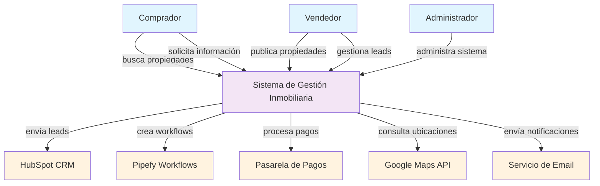

# Arquitectura

## Propósito

Definir y documentar la arquitectura de software del proyecto, incluyendo diagramas C4, stack tecnológico, estructura de código y convenciones de modelado, de forma que tanto personas como copilotos de IA puedan comprender y trabajar con la arquitectura del sistema de manera precisa y segura.

---

## Alcance

Este documento cubre todos los aspectos arquitectónicos del proyecto, incluyendo diagramas de contexto y contenedores (C4 nivel 1 y 2), stack tecnológico, estructura de código, patrones de diseño y convenciones de nomenclatura. Establece el lenguaje ubicuo del dominio y define los mecanismos de desarrollo local y testing. Incluye referencias a ADRs (Architecture Decision Records) y establece la política de actualización como fuente de verdad arquitectónica.

---

## Contexto y Diagramas C4

### Política de Actualización y Fuente de Verdad

Este documento de arquitectura es la **fuente de verdad** en cuanto a componentes e interacciones con sistemas externos (C4 nivel 1 y 2) así como del lenguaje ubicuo del dominio. Debe actualizarse siempre que sucedan cambios arquitectónicos significativos.

**Flujo de trabajo para cambios arquitectónicos:**

1. **ADR (Architecture Decision Record)**: Documentar la decisión arquitectónica con contexto, alternativas y consecuencias.
2. **Actualizar arquitectura.md**: Reflejar los cambios en este documento, incluyendo diagramas C4 actualizados.
3. **Implementar en código**: Trabajar el código siguiendo las nuevas directrices arquitectónicas.

### Convenciones de Diagramas C4

#### Nomenclatura y Tipos de Bloques

**Actores/Usuarios:**
- Formato: `[Persona]` o `[Rol]`
- Ejemplo: `[Comprador]`, `[Vendedor]`, `[Administrador]`
- Descripción mínima: Rol y responsabilidades principales

**Sistema de Interés:**
- Formato: `[Nombre del Sistema]`
- Ejemplo: `[Sistema de Gestión Inmobiliaria]`
- Descripción mínima: Propósito principal y alcance del sistema

**Sistemas Externos:**
- Formato: `[Nombre del Sistema Externo]`
- Ejemplo: `[HubSpot CRM]`, `[Pasarela de Pagos]`, `[Google Maps API]`
- Descripción mínima: Propósito y tipo de integración

**Contenedores:**
- Formato: `[Nombre del Contenedor]`
- Ejemplo: `[API Backend]`, `[Aplicación Web]`, `[Base de Datos]`
- Descripción mínima: Tecnología principal y responsabilidad

#### Tipos de Interacciones

**Comunicación Síncrona:**
- Formato: `[Verbo] [Recurso]`
- Ejemplo: `"envía datos de contacto"`, `"consulta información de propiedad"`

**Comunicación Asíncrona:**
- Formato: `[Verbo] [Evento]`
- Ejemplo: `"publica evento de pago procesado"`, `"consume eventos de usuario"`

**Acceso a Datos:**
- Formato: `"almacena/consulta [tipo de dato]"`
- Ejemplo: `"almacena información de usuarios"`, `"consulta propiedades disponibles"`

### Diagrama de Contexto (C4 Nivel 1)



**Descripción del Contexto:**
- **Propósito**: Sistema integral de gestión inmobiliaria que conecta compradores, vendedores y administradores.
- **Usuarios principales**: Compradores (buscan y solicitan información), Vendedores (publican y gestionan), Administradores (gestionan el sistema).
- **Sistemas externos críticos**: CRM para gestión de leads, workflows para procesos, pasarela de pagos, geolocalización y notificaciones.

### Diagrama de Contenedores (C4 Nivel 2)

```mermaid
graph TB
    %% Actores
    Comprador[Comprador<br/>Busca propiedades y<br/>procesa pagos]
    Vendedor[Vendedor<br/>Gestiona propiedades<br/>y recibe pagos]
    Administrador[Administrador<br/>Monitorea transacciones<br/>y gestiona sistema]
    
    %% Contenedores del Sistema de Gestión Inmobiliaria
    WebApp[Aplicación Web<br/>React + TypeScript + Next.js<br/>Interfaz de usuario y<br/>formularios de pago]
    
    PaymentService[Servicio de Pagos<br/>FastAPI + Python<br/>Procesamiento de transacciones,<br/>validación y reconciliación]
    
    DB[(Base de Datos Principal<br/>PostgreSQL + Alembic<br/>Datos de usuarios, propiedades,<br/>transacciones y logs)]
    
    PaymentDB[(Base de Datos de Pagos<br/>PostgreSQL + Alembic<br/>Transacciones, reconciliación<br/>y auditoría financiera)]
    
    %% Sistemas Externos
    PaymentGateway[Pasarela de Pagos<br/>Stripe/PayPal<br/>Procesamiento de<br/>transacciones financieras]
    
    EmailService[Servicio de Email<br/>SendGrid/AWS SES<br/>Notificaciones<br/>y confirmaciones]
    
    BankAPI[API Bancaria<br/>Verificación de cuentas<br/>y transferencias]
    
    %% Interacciones del Sistema de Pagos
    Comprador -->|"1. Inicia proceso de pago"| WebApp
    Vendedor -->|"2. Gestiona propiedades"| WebApp
    Administrador -->|"3. Monitorea transacciones"| WebApp
    
    WebApp -->|"4. Envía datos de pago"| PaymentService
    
    API -->|"5. Enruta pagos"| PaymentService
    
    PaymentService -->|"6. Valida datos de pago"| PaymentGateway
    PaymentService -->|"7. Procesa transacción"| PaymentGateway
    PaymentService -->|"8. Verifica cuenta bancaria"| BankAPI
    
    PaymentService -->|"9. Almacena transacción"| PaymentDB
    PaymentService -->|"10. Actualiza estado"| DB
    PaymentService -->|"11. Envía confirmación"| EmailService
    
    %% Estilos
    classDef actor fill:#e1f5fe
    classDef container fill:#f3e5f5
    classDef database fill:#e8f5e8
    classDef external fill:#fff3e0
    classDef payment fill:#ffebee
    
    class Comprador,Vendedor,Administrador actor
    class WebApp
    class PaymentService payment
    class DB,PaymentDB database
    class PaymentGateway,EmailService,BankAPI external
```

**Descripción de Contenedores del Sistema de Pagos:**

| Contenedor | Tecnología | Responsabilidad | Escalabilidad |
|------------|------------|-----------------|---------------|
| **Aplicación Web** | React + TypeScript + Next.js | Interfaz de usuario, formularios de pago, gestión de propiedades | Horizontal (múltiples instancias) |
| **API Gateway** | FastAPI + Python | Enrutamiento, autenticación, rate limiting, balanceo de carga | Horizontal (múltiples workers) |
| **Servicio de Autenticación** | FastAPI + JWT | Validación de usuarios, gestión de sesiones, autorización | Horizontal (múltiples instancias) |
| **Servicio de Pagos** | FastAPI + Python | Procesamiento de transacciones, validación, reconciliación | Horizontal (múltiples workers) |
| **Servicio de Propiedades** | FastAPI + Python | Gestión de inventario, disponibilidad, búsqueda | Horizontal (múltiples instancias) |
| **Servicio de Usuarios** | FastAPI + Python | Gestión de perfiles, preferencias, historial | Horizontal (múltiples instancias) |
| **Servicio de Notificaciones** | FastAPI + Python | Envío de confirmaciones, alertas, integración con sistemas externos | Horizontal (múltiples workers) |
| **Base de Datos Principal** | PostgreSQL + Alembic | Datos de usuarios, propiedades, logs del sistema | Vertical (más recursos) |
| **Base de Datos de Pagos** | PostgreSQL + Alembic | Transacciones financieras, reconciliación, auditoría | Vertical (más recursos) |
| **Cache de Sesiones** | Redis | Sesiones activas, rate limiting, datos temporales | Horizontal (cluster) |

---

## Stack Tecnológico

### Frameworks y Librerías Principales

#### Frontend
- **React**: 18.x - Framework de UI con hooks y componentes funcionales
- **TypeScript**: 5.x - Tipado estático para mejor DX y compatibilidad con IA
- **Next.js**: 14.x - Framework full-stack con SSR/SSG
- **Tailwind CSS**: 3.x - Framework de utilidades CSS
- **Zustand**: 4.x - Gestión de estado ligera (NO usar Redux para este proyecto)

#### Backend
- **FastAPI**: 0.104.x - Framework web moderno con documentación automática
- **SQLModel**: 0.0.14 - ORM que combina SQLAlchemy y Pydantic
- **Pydantic**: 2.x - Validación y serialización de datos
- **Alembic**: 1.x - Migraciones de base de datos
- **Uvicorn**: 0.24.x - Servidor ASGI para producción

#### Base de Datos
- **PostgreSQL**: 15.x - Base de datos relacional principal
- **Redis**: 7.x - Cache y sesiones (NO usar para persistencia principal)

#### Herramientas de Desarrollo
- **Docker**: 24.x - Containerización
- **Docker Compose**: 2.x - Orquestación local
- **Make**: Para automatización de tareas de desarrollo
- **GitHub Actions**: CI/CD

### Restricciones y Exclusiones

**NO usar:**
- **Redux**: Zustand es suficiente para este proyecto
- **Django**: FastAPI es más moderno y ligero
- **MongoDB**: PostgreSQL es más adecuado para datos relacionales
- **GraphQL**: REST API es suficiente para los casos de uso actuales
- **WebSockets**: No hay requerimientos de tiempo real

### Mecanismo de Despliegue Local

#### Docker Compose

**docker-compose.yml:**
```yaml
version: '3.8'
services:
  frontend:
    build: ./frontend
    ports:
      - "3000:3000"
    environment:
      - NEXT_PUBLIC_API_URL=http://localhost:8000
    depends_on:
      - backend

  backend:
    build: ./backend
    ports:
      - "8000:8000"
    environment:
      - DATABASE_URL=postgresql://user:password@db:5432/realestate
      - REDIS_URL=redis://cache:6379
    depends_on:
      - db
      - cache

  db:
    image: postgres:15
    environment:
      - POSTGRES_DB=realestate
      - POSTGRES_USER=user
      - POSTGRES_PASSWORD=password
    volumes:
      - postgres_data:/var/lib/postgresql/data
    ports:
      - "5432:5432"

  cache:
    image: redis:7
    ports:
      - "6379:6379"

volumes:
  postgres_data:
```

**docker-compose.override.yml (desarrollo):**
```yaml
version: '3.8'
services:
  frontend:
    volumes:
      - ./frontend:/app
      - /app/node_modules
    command: npm run dev

  backend:
    volumes:
      - ./backend:/app
    command: uvicorn main:app --reload --host 0.0.0.0 --port 8000

  db:
    environment:
      - POSTGRES_PASSWORD=dev_password
```

#### Makefile para Automatización

**Makefile:**
```makefile
.PHONY: up down build rebuild migrate test clean

# Desarrollo
up:
	docker-compose up -d

down:
	docker-compose down

build:
	docker-compose build

rebuild:
	docker-compose down
	docker-compose build --no-cache
	docker-compose up -d

# Base de datos
migrate:
	docker-compose exec backend alembic upgrade head

migrate-create:
	docker-compose exec backend alembic revision --autogenerate -m "$(message)"

# Testing
test:
	docker-compose exec backend pytest
	docker-compose exec frontend npm test

test-watch:
	docker-compose exec backend pytest --watch
	docker-compose exec frontend npm run test:watch

# Limpieza
clean:
	docker-compose down -v
	docker system prune -f

# Logs
logs:
	docker-compose logs -f

logs-backend:
	docker-compose logs -f backend

logs-frontend:
	docker-compose logs -f frontend
```

### Mecanismos de Testing para Developers y Agentes

#### Comandos de Testing Rápido

```bash
# Levantar entorno completo
make up

# Rebuildear después de cambios
make rebuild

# Ejecutar migraciones
make migrate

# Testing de endpoints
curl -X GET http://localhost:8000/api/health
curl -X GET http://localhost:8000/api/properties

# Testing de frontend
curl -X GET http://localhost:3000
```

#### Herramientas Disponibles para Agentes

- **curl**: Para testing de APIs
- **psql**: Para consultas directas a base de datos
- **redis-cli**: Para inspeccionar cache
- **docker exec**: Para ejecutar comandos dentro de contenedores
- **logs en tiempo real**: Para debugging

---

## Estructura de Código

### Organización por Vertical Slices

La estructura del proyecto sigue el patrón de **vertical slices** organizados por dominios de negocio, no por capas técnicas.

```
src/
├── domains/
│   ├── users/
│   │   ├── models/
│   │   │   ├── __init__.py
│   │   │   ├── user.py          # Modelo SQLModel
│   │   │   └── schemas.py       # Esquemas Pydantic
│   │   ├── services/
│   │   │   ├── __init__.py
│   │   │   ├── user_service.py  # Lógica de negocio
│   │   │   └── auth_service.py  # Autenticación
│   │   ├── api/
│   │   │   ├── __init__.py
│   │   │   ├── routes.py        # Endpoints FastAPI
│   │   │   └── dependencies.py  # Dependencias
│   │   ├── tests/
│   │   │   ├── __init__.py
│   │   │   ├── test_models.py
│   │   │   ├── test_services.py
│   │   │   └── test_api.py
│   │   └── README.md            # Documentación del dominio
│   ├── properties/
│   │   ├── models/
│   │   │   ├── __init__.py
│   │   │   ├── property.py
│   │   │   └── schemas.py
│   │   ├── services/
│   │   │   ├── __init__.py
│   │   │   ├── property_service.py
│   │   │   └── search_service.py
│   │   ├── api/
│   │   │   ├── __init__.py
│   │   │   └── routes.py
│   │   ├── tests/
│   │   │   └── ...
│   │   └── README.md
│   └── payments/
│       ├── models/
│       ├── services/
│       ├── api/
│       ├── tests/
│       └── README.md
├── shared/
│   ├── database/
│   │   ├── __init__.py
│   │   ├── connection.py        # Configuración de DB
│   │   └── migrations/          # Alembic
│   ├── auth/
│   │   ├── __init__.py
│   │   ├── jwt_handler.py
│   │   └── permissions.py
│   ├── utils/
│   │   ├── __init__.py
│   │   ├── validators.py
│   │   └── helpers.py
│   └── types/
│       ├── __init__.py
│       └── common.py
├── frontend/
│   ├── src/
│   │   ├── components/
│   │   │   ├── common/
│   │   │   │   ├── Button.tsx
│   │   │   │   └── Input.tsx
│   │   │   ├── users/
│   │   │   │   ├── UserCard.tsx
│   │   │   │   └── UserForm.tsx
│   │   │   └── properties/
│   │   │       ├── PropertyCard.tsx
│   │   │       └── PropertyForm.tsx
│   │   ├── pages/
│   │   │   ├── users/
│   │   │   │   ├── index.tsx
│   │   │   │   └── [id].tsx
│   │   │   └── properties/
│   │   │       ├── index.tsx
│   │   │       └── [id].tsx
│   │   ├── hooks/
│   │   │   ├── useUsers.ts
│   │   │   └── useProperties.ts
│   │   ├── stores/
│   │   │   ├── userStore.ts
│   │   │   └── propertyStore.ts
│   │   └── types/
│   │       ├── user.ts
│   │       └── property.ts
│   ├── public/
│   └── package.json
├── main.py                      # Punto de entrada FastAPI
├── requirements.txt
├── docker-compose.yml
├── docker-compose.override.yml
├── Makefile
└── README.md
```

### Nomenclatura y Lenguaje Ubicuo

#### Convenciones de Nomenclatura

**Entidades de Dominio:**
- **Usuario**: `User` (modelo), `user` (variable), `users` (colección)
- **Propiedad**: `Property` (modelo), `property` (variable), `properties` (colección)
- **Pago**: `Payment` (modelo), `payment` (variable), `payments` (colección)

**Servicios:**
- Formato: `<Dominio>Service`
- Ejemplo: `UserService`, `PropertyService`, `PaymentService`

**Endpoints:**
- Formato: `/api/<dominio>/<recurso>`
- Ejemplo: `/api/users`, `/api/properties`, `/api/payments`
- **Estándares REST:**
  - **Métodos HTTP estándar**: GET, POST, PUT, PATCH, DELETE
  - **Códigos de estado HTTP**: 200, 201, 400, 401, 403, 404, 500
  - **Formato de respuesta**: JSON consistente con estructura `{data, message, errors}`
  - **Versionado**: `/api/v1/<dominio>/<recurso>` para cambios breaking
  - **Paginación**: Query parameters `?page=1&limit=20` para colecciones
  - **Filtrado**: Query parameters `?status=active&type=residential`
  - **Ordenamiento**: Query parameter `?sort=created_at&order=desc`
  - **Búsqueda**: Query parameter `?q=search_term` para búsquedas de texto

**Componentes Frontend:**
- Formato: `<Dominio><Componente>`
- Ejemplo: `UserCard`, `PropertyForm`, `PaymentModal`

#### Lenguaje Ubicuo del Dominio

**Conceptos Clave:**
- **Usuario**: Persona que interactúa con el sistema (comprador, vendedor, administrador)
- **Propiedad**: Inmueble disponible para compra/venta
- **Lead**: Interés potencial en una propiedad
- **Pago**: Transacción monetaria relacionada con una propiedad
- **Workflow**: Proceso automatizado de gestión de leads

**Verbos de Dominio:**
- **Publicar**: Acción de un vendedor de hacer visible una propiedad
- **Buscar**: Acción de un comprador de encontrar propiedades
- **Solicitar**: Acción de un comprador de obtener más información
- **Procesar**: Acción del sistema de manejar una solicitud o pago

### Ubicación de Funciones y Responsabilidades

#### Backend (FastAPI + SQLModel)

**Modelos (`models/`):**
- Definición de entidades SQLModel
- Relaciones entre entidades
- Validaciones a nivel de modelo

**Servicios (`services/`):**
- Lógica de negocio
- Integración con sistemas externos
- Operaciones complejas que involucran múltiples modelos

**API (`api/`):**
- Endpoints HTTP
- Validación de entrada
- Transformación de respuesta
- Autenticación y autorización

**Dependencias (`api/dependencies.py`):**
- Inyección de dependencias
- Autenticación
- Validación de permisos

#### Frontend (React + TypeScript)

**Componentes (`components/`):**
- UI reutilizable
- Lógica de presentación
- Manejo de estado local

**Páginas (`pages/`):**
- Rutas de la aplicación
- Composición de componentes
- Lógica de navegación

**Hooks (`hooks/`):**
- Lógica reutilizable
- Integración con APIs
- Manejo de estado global

**Stores (`stores/`):**
- Estado global (Zustand)
- Persistencia de datos
- Sincronización con backend

### Metadatos para IA

Cada archivo debe incluir metadatos estructurados:

```python
"""
@scope: api, cli, test
@slice: users, properties, payments
@layer: model, service, controller, view
@type: entity, usecase, gateway, test
"""
```

```typescript
/**
 * @scope: frontend, test
 * @slice: users, properties, payments
 * @layer: component, page, hook, store
 * @type: ui, logic, state, test
 */
```

---

## Patrones de Diseño y Convenciones

### Patrones de Backend

**Repository Pattern:**
- Encapsular acceso a datos
- Facilitar testing con mocks
- Separar lógica de negocio de persistencia

**Service Layer:**
- Contener lógica de negocio
- Orquestar operaciones complejas
- Manejar transacciones

**Dependency Injection:**
- Usar FastAPI Depends()
- Facilitar testing
- Reducir acoplamiento

### Patrones de Frontend

**Container/Presentational:**
- Separar lógica de presentación
- Facilitar testing
- Mejorar reutilización

**Custom Hooks:**
- Encapsular lógica reutilizable
- Integrar con APIs
- Manejar estado local

**Zustand Stores:**
- Estado global ligero
- Persistencia opcional
- DevTools integrados

### Convenciones de Testing

**Backend:**
- Pytest para testing unitario
- Factory Boy para fixtures
- Coverage mínimo 80%

**Frontend:**
- Jest + Testing Library
- Componentes aislados
- Mocks para APIs externas

---

## Integración con Otros Documentos

Este documento se relaciona con:

- **[database.md](database.md)**: Estructuras de datos y modelos
- **[security.md](security.md)**: Autenticación y autorización
- **[testing.md](testing.md)**: Estrategias de testing
- **[deployment.md](deployment.md)**: Despliegue y configuración

### ADRs Relacionados

- **[ADR-001](docs/adr/ADR-001-fastapi-sqlmodel.md)**: Uso de FastAPI + SQLModel para backend
- **[ADR-002](docs/adr/ADR-002-vertical-slices.md)**: Organización por vertical slices
- **[ADR-003](docs/adr/ADR-003-tech-stack.md)**: Stack tecnológico y restricciones

---

## Validación y Cumplimiento

### Validaciones Automatizadas

- **Convenciones de nombres**: Linting de Python y TypeScript
- **Estructura de archivos**: Scripts de validación de estructura
- **Metadatos**: Verificación de presencia de tags
- **Documentación**: Alertas de documentación desactualizada

### Herramientas de Validación

- **pre-commit hooks**: Validaciones antes de commit
- **CI/CD**: Validaciones en pipeline
- **Linters**: ESLint, Pylint, Black, isort
- **Type checkers**: mypy, TypeScript compiler

---

## Formato y Consistencia

Este documento debe cumplir las pautas de [`markdown-guidelines.md`](markdown-guidelines.md), incluyendo:

- Encabezados **ATX** (`#`, `##`, `###`)
- Un único encabezado H1 al inicio
- Línea en blanco antes y después de cada encabezado
- Bloques de código con fences y lenguaje especificado
- Diagramas Mermaid para visualización

### Cumplimiento Automatizado

Para asegurar la coherencia de la arquitectura y el código:

- **Validación de estructura**: Verificar que los archivos estén en las ubicaciones correctas
- **Convenciones de nombres**: Adherencia a patrones establecidos
- **Metadatos**: Presencia de tags necesarios para IA
- **Documentación**: Sincronización con cambios en código

La implementación de estas validaciones será responsabilidad del equipo de **DevOps** o **SRE** del proyecto.
